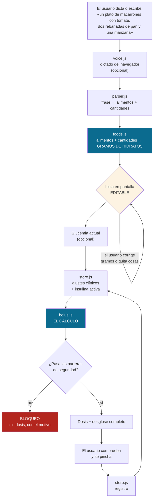
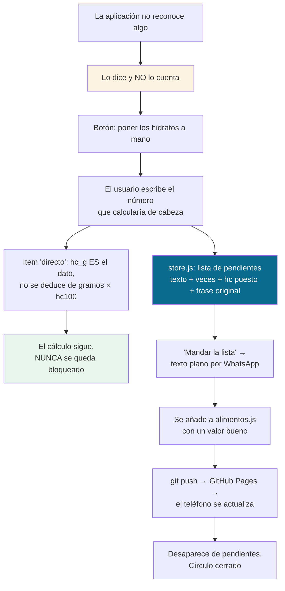
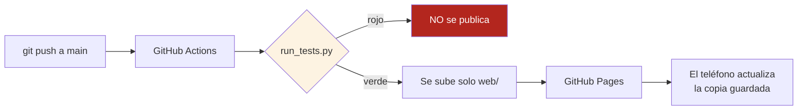

# Flujo de trabajo

Cómo funciona la aplicación de principio a fin, y quién es responsable de qué.

---

## 1. El recorrido completo



Dos cosas que no son casuales en ese diagrama:

- **`parser.js` nunca produce gramos de hidratos.** Solo produce pares
  *(alimento, cantidad)*. Los hidratos los pone siempre `foods.js` a partir de
  la base de datos. Así el peor fallo posible del intérprete es reconocer mal
  un alimento, que el usuario **ve** en la lista, y no un valor de hidratos
  inventado, que nadie puede detectar a ojo.
- **La lista es editable y está en medio del camino.** No hay forma de llegar a
  una dosis sin pasar por ella.

---

## 2. Quién hace qué

| Módulo | Responsabilidad | Lo que NO hace |
|---|---|---|
| `data/alimentos.js` | Los gramos de hidratos. Única fuente de verdad | — |
| `foods.js` | Índice, búsqueda tolerante, porciones → gramos → hidratos | No interpreta frases |
| `parser.js` | Frase en español → *(alimento, cantidad)* | **No calcula hidratos** |
| `bolus.js` | Las fórmulas, los bloqueos y los avisos | No toca DOM, almacenamiento ni red |
| `store.js` | Ajustes, registro, alimentos propios, insulina activa | No calcula la dosis |
| `voice.js` | Dictado del navegador, con degradación limpia | No es imprescindible |
| `llm.js` | Ayuda opcional (apagada). Interfaz agnóstica | **No calcula dosis ni fija hidratos** |
| `app.js` | Interfaz: leer pantalla, llamar módulos, pintar | **No contiene ni una fórmula** |

`bolus.js` es un módulo puro a propósito: es lo que permite ejecutarlo en V8
desde pytest y probar 71 casos del cálculo sin abrir un navegador.

---

## 3. Cómo se lee una frase

`parser.js` recorre la frase de izquierda a derecha. En cada posición:

1. **Quita las muletillas del principio** («voy a comer», «hoy para cenar»).
2. **Lee una cantidad:** un número (`3`, `0,5`, `1/2`), una palabra (`dos`,
   `medio`, `media docena`, `un par`) o nada.
3. **Lee una unidad:** de peso (`g`, `ml`, `kg`, `litro`) o de casa (`plato`,
   `rebanada`, `vaso`, `cucharada`, `lata`, `onza`…).
4. **Busca el alimento**, primero por coincidencia exacta con **la frase más
   larga posible** —para que «macarrones con tomate» gane a «macarrones»— y
   solo si eso falla, por aproximación.
5. **Convierte a gramos:** peso explícito > porción propia del alimento >
   porción genérica > ración supuesta. Cada camino da una confianza distinta.
6. **Convierte a hidratos** con `hc100` y emite el item.

### Las tres reglas que nacieron de fallos reales

Están documentadas en el código con el fallo que las provocó, y cada una tiene
su test:

**La regla del «bocadillo».** Hay palabras que son a la vez medida y comida.
«Un bocadillo de jamón» tomado al pie de la letra son 170 g de jamón, o sea
0,8 g de hidratos, cuando un bocadillo son unos 56 g: **unas 5 unidades de
insulina de diferencia**. Si desde la palabra-unidad arranca el nombre de un
alimento, gana el alimento.

**La regla del «a la».** «Espaguetis a la carbonara» reconocía la pasta *y*
el plato, y contaba los hidratos dos veces. Cuando detrás de un ingrediente
viene «a la…» o «al…» y eso nombra un plato completo, gana el plato.

**Las guardas de longitud.** Palabras de dos o tres letras casaban por
aproximación con alimentos parecidos: «no» con *nocilla*, «se» con *setas*,
«que» con *queso*. La frase «un plato de no sé qué» producía **144 g de
hidratos de la nada**, unas 14 unidades de insulina. Ahora no se aproximan
palabras de menos de cuatro letras, y lo buscado y lo encontrado tienen que
ser de tamaño parecido. Los alimentos de nombre corto (pan, té, uva, miel) no
se pierden: esos los resuelve la búsqueda exacta.

### Lo que no se entiende, se dice

Nunca se omiten hidratos en silencio. Hay tres canales de aviso:

| Caso | Qué pasa |
|---|---|
| Palabra desconocida | Va a `no_reconocido`, se avisa, la confianza baja a «media» |
| Cantidad sin alimento («un plato de…») | Va a `sin_alimento`, se avisa, **la confianza baja a «baja»** |
| Nada reconocible | 0 g de hidratos y aviso. Nunca se inventa un valor |

---

## 3 bis. El ciclo de las comidas no registradas

La base nunca va a estar completa, así que el diseño no depende de que lo esté.



**Por qué está montado así.** El usuario no tiene por qué saber los hidratos
por 100 g de nada: es un dato de etiqueta. Lo que sí sabe estimar, porque lleva
toda la vida haciéndolo, es cuántos gramos de hidratos lleva *su* plato. Pedirle
lo primero le bloquearía; pedirle lo segundo es pedirle lo que ya hace.

Un item `directo` lleva `hc100: null` y `directo: true`: `recalcularItem` no lo
toca y el cuadro editable de su fila son gramos de hidratos, no gramos de
alimento.

El `veces` de cada pendiente es lo que hace útil la lista un mes después: dice
qué añadir primero. Y el `contexto` —la frase original— evita que quien la
revise se encuentre con una palabra suelta («txangurro») sin saber de qué plato
venía.

---

## 4. Cómo se calcula la dosis

`bolus.js` es la única puerta al cálculo. Recibe `(entrada, ajustes)` y
devuelve un objeto con todo:

```
entrada  { hc_g, glucosa?, iob_u?, momento? }
ajustes  { objetivo, ratio, fsi, paso, redondeo, max_u, umbral_hipo,
           umbral_alto, restar_iob, duracion_insulina_h, por_momento, ... }

salida   { ok, bloqueo, avisos[], bolo_comida, bolo_correccion,
           iob_restada, total_bruto, total, desglose[], ratio, fsi, objetivo }
```

Orden de las comprobaciones. **Importa**: cada una para antes de llegar a la
siguiente, para que la más grave gane siempre.

```
1. ¿Hay hidratos y son un número?          → si no: FALTAN_HC
2. ¿Son plausibles (0-400 g)?              → si no: HC_IMPLAUSIBLES
3. ¿La glucemia es medible (20-800)?       → si no: GLUCOSA_IMPLAUSIBLE
4. ¿Hay hipoglucemia?                      → si sí: HIPOGLUCEMIA  ← se para TODO
5. ¿Están el ratio, el FSI y el objetivo,
   y son plausibles?                       → si no: FALTA_* / *_IMPLAUSIBLE
6. bolo_comida = hc / ratio
7. bolo_correccion = (glucemia - objetivo) / fsi     (0 si no hay glucemia)
8. total = comida + correccion - insulina_activa     (si está activado restarla)
9. total = max(0, total)                             (nunca negativo)
10. total = redondear(total, paso, modo)
11. ¿Pasa del tope absoluto de 100 U?      → si sí: DOSIS_ABSURDA (no confirmable)
12. ¿Pasa del máximo del usuario?          → si sí: SUPERA_MAXIMO (confirmable)
```

**Ningún parámetro clínico tiene valor por defecto.** Ni en `bolus.js` ni en
`store.js`. Si falta uno, se bloquea. Un valor por defecto plausible sería lo
más peligroso que podría hacer este programa: calcularía dosis que nadie ha
prescrito.

**El bloqueo por hipoglucemia no muestra ningún número.** No es que aparezca
tachado: no se calcula.

**El bloqueo por máximo sí muestra el número**, porque el usuario necesita
verlo para entender qué le ha pasado, pero exige una confirmación explícita
antes de darlo por bueno.

---

## 5. La insulina activa

```
insulina_activa(dosis, horas, duración) = dosis × max(0, 1 − horas/duración)
```

Decaimiento **lineal** sobre la duración de acción (4 h por defecto). Es un
modelo deliberadamente simple: las curvas reales de los análogos rápidos no
son lineales. Sirve para **avisar** de que queda insulina trabajando, no para
dosificar con precisión de bomba.

`store.js` la calcula sumando los pinchazos de tipo `rapida` del registro que
estén dentro de la ventana. **La insulina lenta no cuenta**: tiene otra curva
completamente distinta, y meterla aquí sería un error grave. Hay un test que
lo comprueba.

Por defecto **avisa pero no resta**. Restar automáticamente es lo que hacen las
bombas, pero es una decisión clínica: si el médico no le ha explicado al
usuario cómo se usa el concepto, la aplicación no debe tomarla por él. El
interruptor está en Ajustes.

---

## 6. Los datos

```
localStorage del navegador de ESE teléfono
├── insulina.ajustes     los parámetros y las preferencias
├── insulina.registro    las anotaciones (tope 2000)
├── insulina.alimentos   los alimentos que el usuario añade o corrige
└── insulina.comidas     las comidas guardadas
```

**No hay servidor, ni cuenta, ni copia en la nube.** Son datos de salud: la
única forma de que salgan del teléfono es que el usuario pulse «Descargar
copia» y comparta el archivo él mismo.

Contrapartidas asumidas y documentadas:

- Si se borran los datos del navegador, se pierde el registro → hay exportación
  a JSON y la guía la recomienda.
- No hay sincronización entre dispositivos → se mueve con exportar/importar.
- En navegación privada, leer `localStorage` **lanza una excepción**. La
  aplicación se cae a una copia en memoria, sigue calculando y lo dice en
  pantalla. Hay un test que lo cubre.

Los alimentos del usuario **tienen prioridad** sobre los de la base: si guarda
uno con el mismo identificador, sustituye al de fábrica. Es la vía para
corregir un valor con el que no esté de acuerdo.

Un alimento sin un valor de hidratos utilizable **no se guarda**. Si entrara,
aportaría 0 g al total sin que nadie lo notase, o sea insulina de menos. La
validación es de tipo, no de finitud: `Number(null)` vale 0 y es finito, y por
ahí se colaba (fallo real, encontrado por los tests).

---

## 7. Sin conexión

`sw.js` guarda la aplicación entera en el teléfono. No es un adorno: hace falta
calcular la dosis en un restaurante con mala cobertura o con los datos
agotados.

- **Al abrir la aplicación:** red primero, y si falla, la copia guardada. Así
  una versión nueva entra en cuanto hay conexión.
- **Todo lo demás:** copia guardada primero (instantánea) y refresco en
  segundo plano.
- **Otros dominios:** nunca se guardan. Si se activa la ayuda con IA, sus
  peticiones van siempre a la red.

Al publicar una versión nueva hay que subir `VERSION` en `sw.js` **y**
`VERSION_APP` en `app.js`. Es lo que tira la copia vieja. Hay un test que
comprueba que coincidan.

---

## 8. Cómo se prueba

```bash
python run_tests.py
```

**Los tests ejecutan el JavaScript real de `web/js/` dentro de V8**
(py-mini-racer), no una reimplementación en Python. Para un cálculo que acaba
en una jeringa, probar una copia del código no sirve de nada: hay que probar
exactamente el que se despliega.

| Archivo | Tests | Qué cubre |
|---|---|---|
| `test_bolus.py` | 71 | El cálculo, los bloqueos, el redondeo, la insulina activa, los parámetros por momento |
| `test_parser.py` | 58 | Cantidades, unidades, frases completas, negaciones, erratas, y **que el ruido no produzca hidratos** |
| `test_alimentos.py` | 46 | Rangos, unidades, coherencia crudo/cocido, y que cada alimento se encuentre por su nombre |
| `test_store.py` | 41 | Ajustes, registro, insulina activa, validación y copias |
| `test_entrega.py` | 30 | Sintaxis de todo el JS, orden de carga, manifiesto, versiones, cero recursos externos, cero claves |

Los tests que más valor tienen no comprueban que la aplicación acierte, sino
que **falle en la dirección correcta**: que bloquee cuando falta un dato, que
no cuente lo que no ha entendido y que no invente nada.

---

## 9. Publicar



La acción publica **solo `web/`**, no el repositorio entero: los tests, las
herramientas y esta documentación no tienen por qué estar en internet. Y no
publica si los tests están en rojo.
